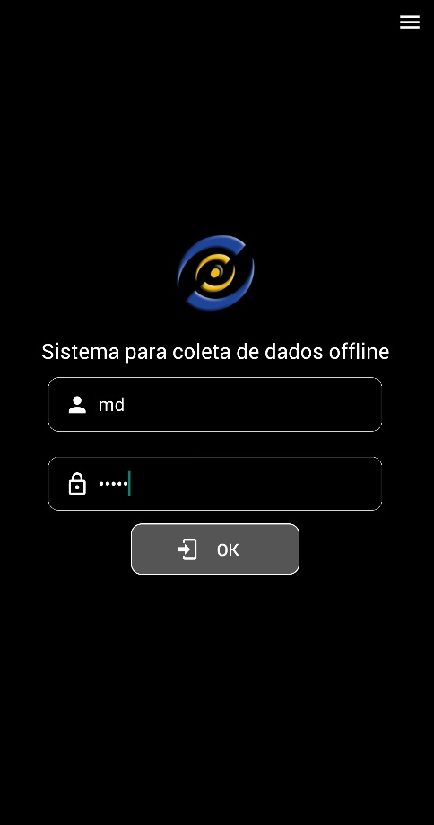
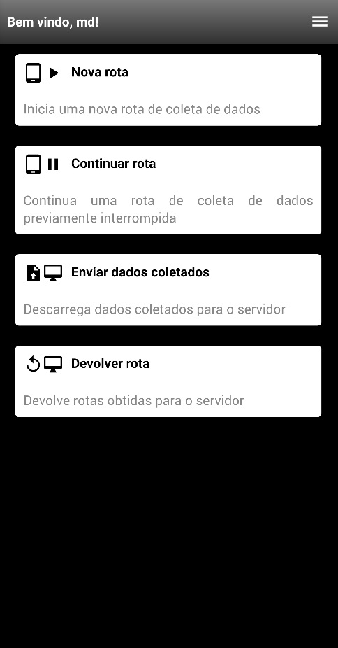
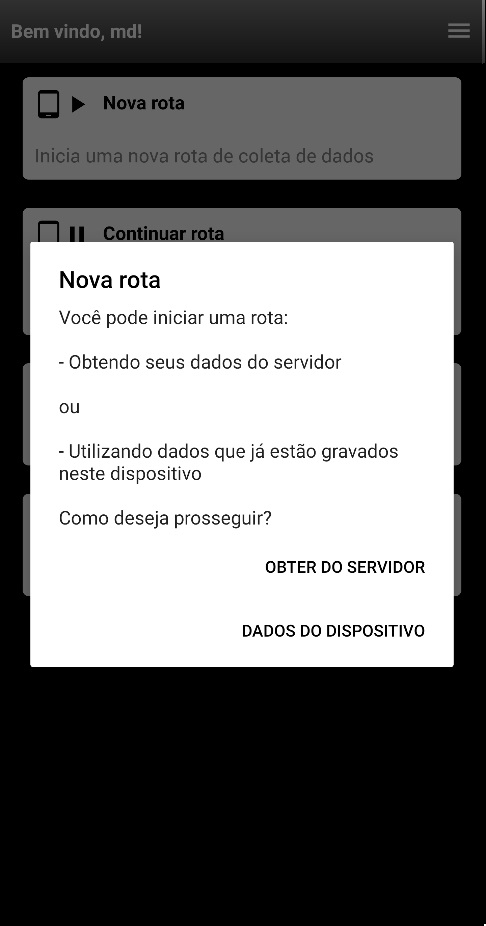
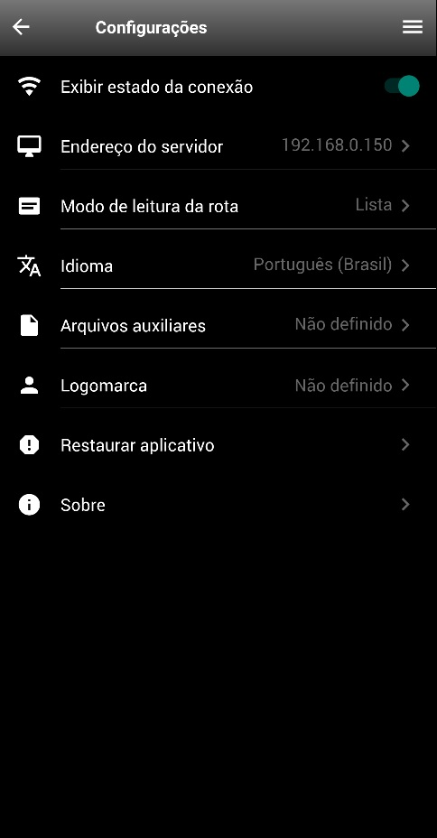
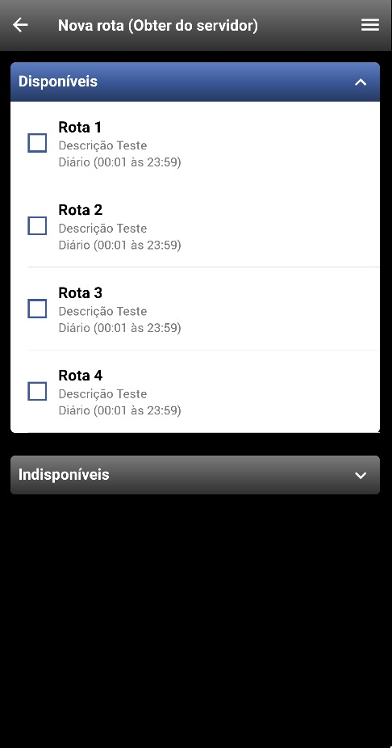
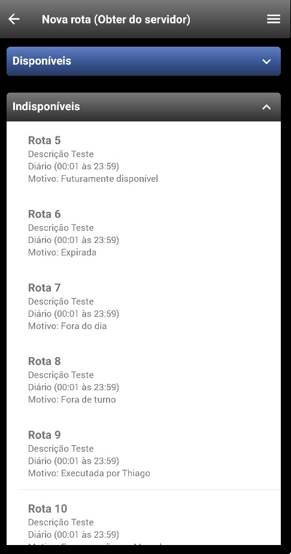

# Relatório mensal - Maio de 2020

## 1 - Continuação da migração de tecnologia do coletor Android/iOS

O foco principal do mês de maio foi a continuação da migração da tecnologia de desenvolvimento dos módulos envolvidos na aplicação de coleta off-line.

### 1.1 - Novas telas

#### 1.1.1 - Tela de login

O usuário deverá informar seu login e senha cadastrados no Sistema MDM para ter acesso à aplicação.

### 1.1.2 - Tela de boas vindas

É a interface de entrada do sistema, a partir da qual o usuário executará suas ações. Nesta tela, ele poderá iniciar uma nova rota, continuar uma rota previamente interrompida, descarregar dados coletados, ou devolver uma rota obtida por engano.

Ao selecionar as opções "Nova Rota" ou "Continuar rota", o usuário poderá informar se gostaria de obter uma lista de rotas diretamente do servidor ou se as rotas já estão no dispositivo (pois já foram baixadas em outro momento), conforme figura ilustrada a seguir:

### 1.1.3 - Configurações

A principal tela de configurações do sistema, onde o usuário poderá configurar o endereço de acesso ao servidor, idioma do aplicativo, fazer upload da logo de sua empresa, entre outras opções.

### 1.1.4 - Obter rotas do servidor

Nesta tela, o usuário terá acesso às rotas que estão no servidor. As rotas virão categorizadas em listas colapsáveis entre disponíveis e indisponíveis. Caso indisponível, será exibida também a razão deste fato.

### 1.1.4.1 - Rotas disponíveis expandidas

### 1.1.4.2 - Rotas indisponíveis expandidas

