# Relatório mensal - junho de 2020
## 1 - Coletor em modo online durante a coleta de dados
Uma nova funcionalidade foi desenvolvida foi desenvolvida para a nova versão do coletor, que prevê o caso de o mesmo estar online durante a rota de inspeção. Neste caso, ao posicionar-se em um local onde exista conectividade durante a coleta de dados, o software de rota será capaz de transmitir dados ao servidor. Entre os principais dados, podemos destacar: status da execução, métricas de tempo decorrido, interrupções e suas devidas justificativas, alterações na ordem da coleta, entre outros.\
Com esta nova funcionalidade, será possível visualizar no servidor, em tempo real, o status da execução das rotas.
### 1.1 - Ícone de status da conexão
Para determinar se o coletor está online e apto para a transferência de dados, foi adicionado um ícone na interface, com o símbolo de uma conexão wi-fi. A conectividade é verificada periodicamente de forma automática. Caso seja possível conectar-se, o ícone será exibido na cor verde. Caso contrário, será exibido na cor vermelha.

Sem conectividade              |  Com conectividade
:-----------------------------:|:-----------------------------:
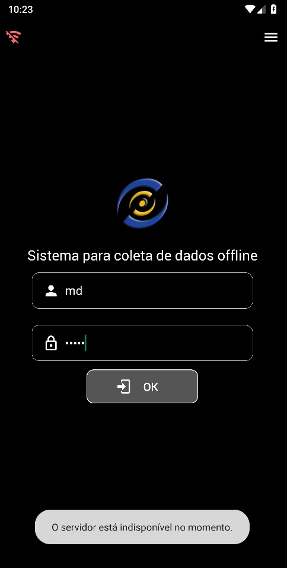  |  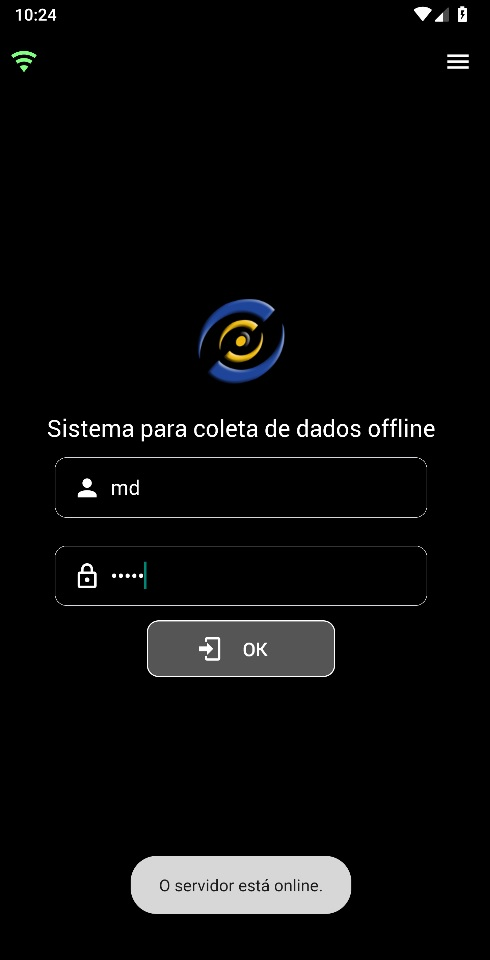

Interessante notar que, ao tocar sobre o ícone que representa a conectividade, será exibida uma mensagem no formato "toast" informando o status da conexão. A mensagem desaparece automaticamente após aproximadamente 3 segundos.

Após realizar login, o ícone da conectividade será posicionado dentro do cabeçalho, ali permanecendo durante todo o ciclo de vida da aplicação.

Sem conectividade        |  Com conectividade
:-----------------------:|:-----------------------:
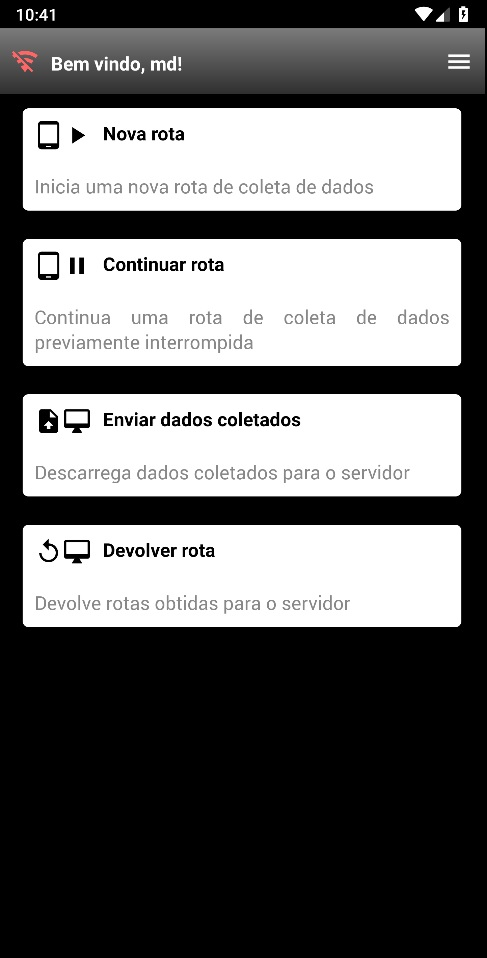  |  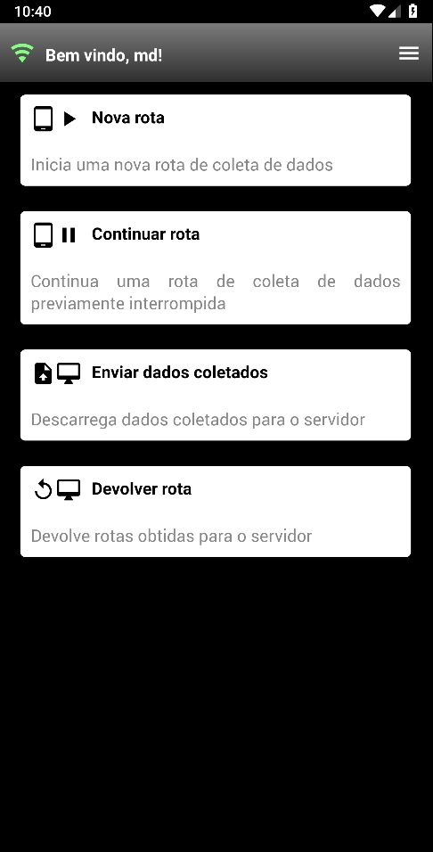

## 2 - Continuando desenvolvimento (novas telas)

### 2.1 - Leitura do código de barras

  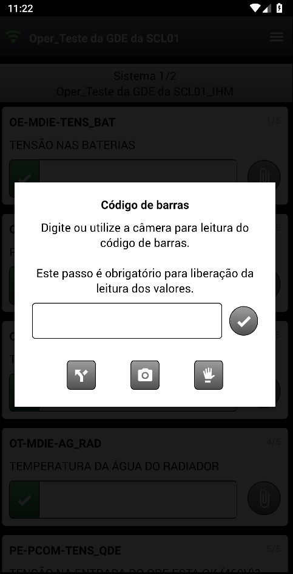

O input do código de barras pode ser feito manualmente ou através da câmera. Caso seja feito pela câmera, o leitor suporta códigos 1D (Code-128, Code-39, entre outros) e também 2D (QRCode).

Código 1D                        |  Código 2D
:-------------------------------:|:-------------------------------:
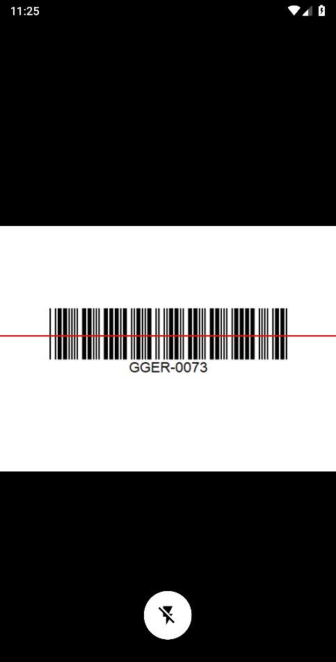  |  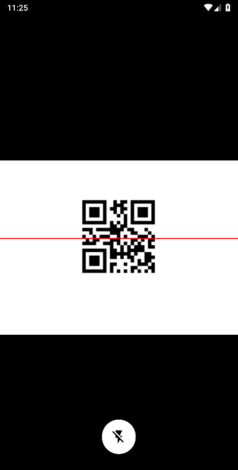

Na versão Android, o flash pode ser acionado, ao clicar no ícone correspondente, para leitura em locais de pouca luminosidade.

### 2.2 - Interrupção da rota

Interromper rota                 |  Opções de interrupção
:--------------------------------:|:-------------------------------:
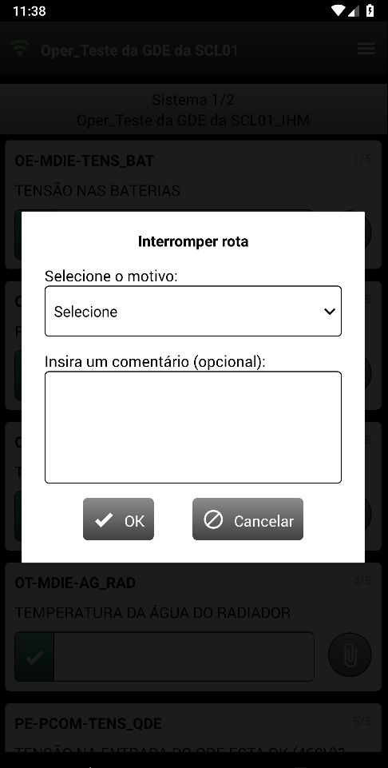  |  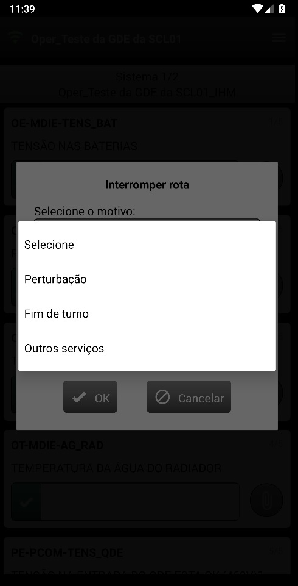

O motivo é um campo obrigatório, o comentário é um campo opcional.

### 2.3 - Alteração do fluxo da rota

É possível alterar o fluxo da rota conforme a necessidade do usuário. Caso opte pela alteração, o usuário deverá justificar.

Alterar fluxo                  |  Justificar alteração
:-----------------------------:|:-------------------------------:
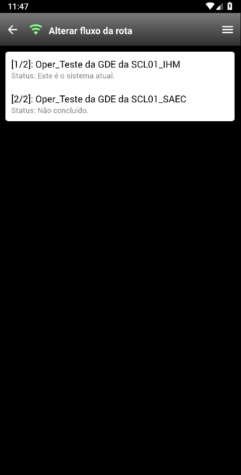  |  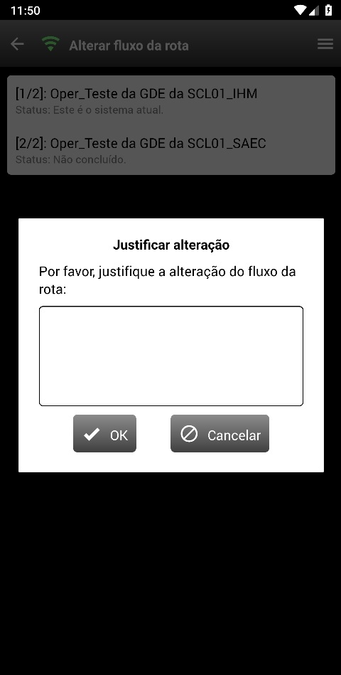

### 2.4 - Preenchimento dos valores: Campo instrumentado

O campo instrumentado é representado por um input de texto. O valor deverá ser preenchido de acordo com o valor lido no instrumento correspondente. Caso o valor esteja dentro de uma faixa de validação previamente configurada, o campo será preenchido na cor verde. Caso contrário, será preenchido na cor vermelha.

  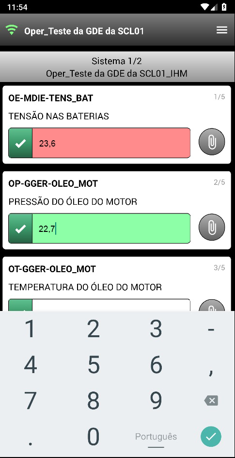

### 2.4 - Preenchimento dos valores: Campo sensitivo

O campo sensitivo é representado por uma caixa de seleção. Ao tocar, o usuário deverá selecionar o valor da leitura. O ícone "dedo levantado" representa a resposta esperada. O ícone "folhas de papel" representa que tal opção requer a abertura de nota técnica.

Campo sensitivo: Opções                 |  Campo preenchido
:--------------------------------------:|:-------------------------------:
  |  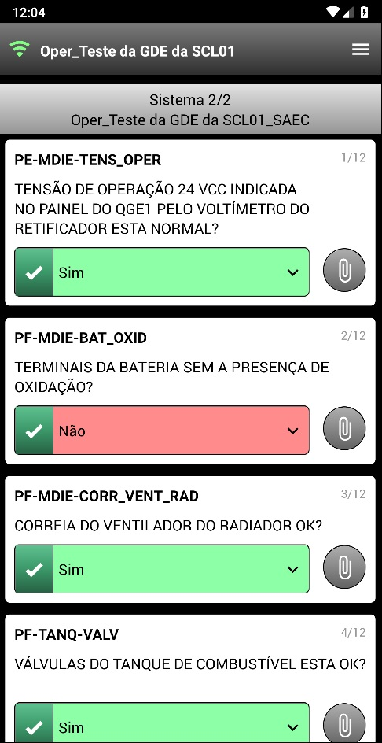
