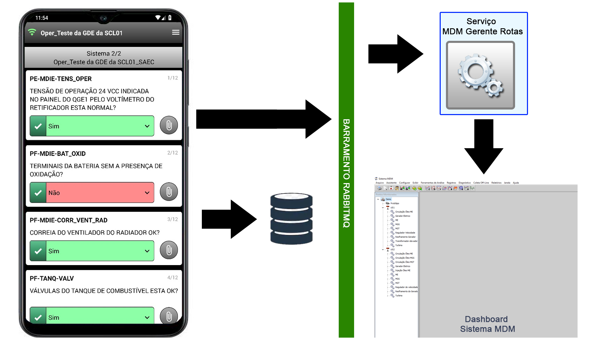
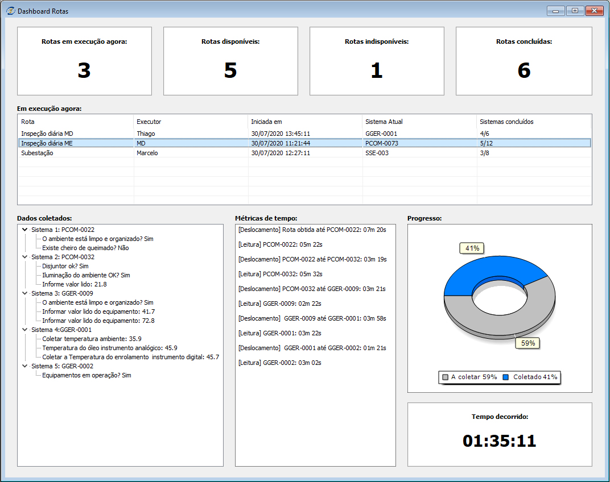

# Relatório Mensal - julho de 2020

## 1 - Streaming de dados em tempo real

Avançando nas novas funcionalidades do coletor, existe a previsão de o dispositivo estar online durante determinados momentos da coleta de dados. Neste caso, 
ao posicionar-se em um local onde exista conectividade , o software será capaz de transmitir dados ao servidor.\
Entre os principais dados, podemos destacar: rotas em execução, ponto atual da execução e informações de temporização. De posse destes dados,
será possível visualizá-los no servidor, em tempo real.

### 1.1 - Arquitetura de comunicação

Enquanto a aplicação estiver sem conexão, os dados de coleta são armazenados apenas na memória interna do dispositivo.\
Quando a conexão for realizada, os dados continuam sendo armazenados na memória, porém o coletor iniciará uma publicação de dados para o servidor.

  

Aplicação sem conexão: Os dados são armazenados apenas na memória interna do aparelho.
 
 
   

  

  Aplicação conectada: Dados continuam sendo armazenados na memória, porém também são enviados ao servidor.

#### 1.2 - Informações sobre o dashboard

#### 1.2.1 - Dados disponíveis

- Rotas em execução no momento
- Ponto atual da execução das rotas
- Percentuais de conclusão
- Informações sobre temporização

#### 1.2.1 - Visão geral

  

#### 1.2.2 - Descrição dos campos

Todos os dados são exibidos em tempo real.

- **Rotas em execução agora:** Exibe um contador da quantidade de rotas que estão sendo executadas em determinado momento.
- **Rotas disponíveis:** Informa a quantidade de rotas que estão disponíveis no momento. Rotas em execução não fazem parte desta contagem, considerando-se então apenas as rotas que ainda não foram iniciadas.
- **Rotas indisponíveis:** Informa o contador de rotas que não estão disponíveis no momento. Os motivos podem variar, as possíveis causas são:
  - *Futuramente disponível:* A rota foi programada para estar disponível apenas em um futuro próximo.
  - *Fora de turno:* Aplicável a rotas com periodicidade diária, a rota pertence a um outro turno que não o atual.
  - *Fora do dia:* Aplicável a rotas com periodicidade semanal ou mensal, a rota deve ser executada em um dia diferente do atual.  
- **Rotas concluídas:** Informa a contagem das rotas que já tiveram seus dados coletados e enviados ao servidor.

- **Em execução agora:** Esta lista exibe as rotas que estão sendo executadas em determinado momento. Ela funciona no padrão "mestre-detalhe" em conjunto com os dados que estão na parte inferior da tela, isto é, ao clicar em uma das rotas disponíveis na lista, os componentes inferiores são populados com dados relacionados à rota selecionada.

- **Dados coletados:** Este componente exibirá as respostas que estão sendo coletadas na rota em andamento.

- **Métricas de tempo:** Este componente é o responsável por exibir a temporização das rotas. Os detalhes incluem tempos de deslocamento e o tempo gasto com a leitura de dados.
- **Progresso:** Informação gráfica sobre o percentual de conclusão da rota, onde são exibidos os dados relativos ao que já foi coletado (campo azul) e o que ainda está por coletar (campo cinza).
- **Tempo decorrido:** Exibe um contador de tempo da rota selecionada. 
