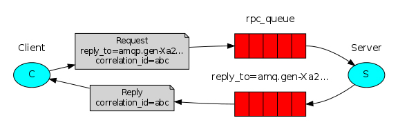
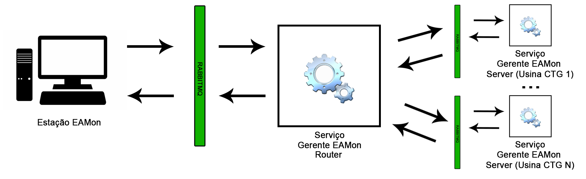

# Relatório mensal - agosto de 2020

# Comunicação entre Sistema MDM x Portal EAMon

## 1 - Protocolo

A comunicação entre o Sistema MDM e o portal EAMon será estabelecida através do protocolo AMQP (Advanced Message Queuing Protocol). O AMQP é uma especificação para troca de mensagens assíncronas que tem como principal característica o fato de favorecer a interoperabilidade entre diferentes plataformas, assim como demanda este projeto.

### 1.1 - Sobre a comunicação

O protocolo AMQP estabelece a comunicação entre os *publishers* (aplicações que são responsáveis por produzir e publicar as mensagens) e os *consumers* (que são aplicações que recebem e processam as mensagens). Em nosso modelo de comunicação, o *consumer* também será capaz de responder ao *publisher*, fornecendo uma resposta quanto ao resultado do processamento. Este padrão de comunicação entre sistemas é denominado *RPC* (Remote Procedure Call, ou Chamada de Procedimento Remoto).

Realizando um estudo de caso em nossa aplicação, o Portal EAMon atua como *publisher* (aquele que realiza a requisição) e o serviço do Sistema MDM atua como *consumer* (serviço responsável por receber e processar a requisição e, em nosso caso, também informar o resultado do processamento).

A arquitetura da comunicação RPC é ilustrada conforme a figura a seguir:

  

### 1.2 - Comunicação entre os sistemas

A disponibilização de informações será realizada do lado do sistema MDM a partir de um novo módulo, denominado "Gerente EAMon". O portal deverá realizar as requisições para este componente. A seguir, serão listadas as informações disponibilizadas do Sistema MDM para consulta no portal EAMon.

A arquitetura da comunicação entre EAMon e o gerente é ilustrada a seguir:

  

## 2 - Detalhes das funcionalidades

### 2.1 - Importar dados

**Objetivo:** Relizar a importação de uma planilha excel com dados de registro, em formato csv pré-definido, para o banco de dados do MDM.

**Parâmetros de entrada:**

Nome       |  Tipo
:---------:|:---------------:
inputData  | string

**Parâmetros de saída:**

Nome       |  Tipo
:---------:|:---------------:
status     | number 
content    | string

