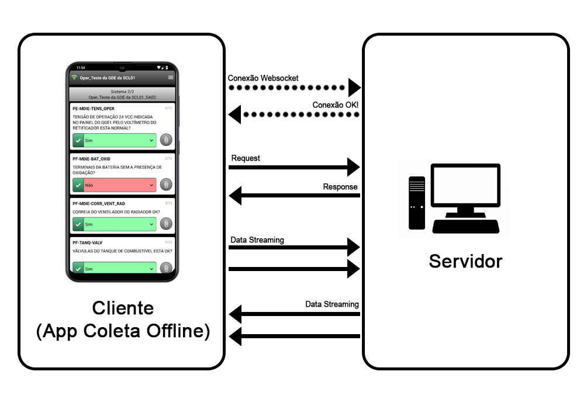

# Relatório mensal - Dezembro / 2020

## Utilização de websockets

Durante o mês de dezembro de 2020, o foco do desenvolvimento foi a melhoria da comunicação cliente x servidor. Na nova versão, utilizaremos uma tecnologia denominada websocket.

### Sobre os websockets

Normalmente, a comunicação "regular" entre cliente e servidor consiste em uma série de pedidos e respostas entre eles. Mas para aplicações web que demandam alto volume de tráfego de dados e respostas em tempo real, esta técnica pode não ser adequada.

O websocket é um protocolo de comunicação padronizado para ambientes web. O websocket provê interação entre um cliente (neste projeto, o coletor de dados offline) e um servidor web onde a conexão é estabelecida uma única vez. Ou seja, o túnel de comunicação é estabelecido e persistido e, partindo deste princípio, a comunicação pode ocorrer a qualquer momento sem atrasos ou "lags". Este é o princípio utilizado por aplicações de tempo real, como chats ou jogos online.

A principal diferença entre os websockets e o protocolo HTTP é a comunicação em duas vidas, onde trabalhamos com o padrão *request - response.* Isto facilita a tranferência de dados em tempo real entre cliente e servidor. Outra diferença é a possibilidade de transferência de dados do servidor para o cliente sem a existência de uma requisição explícita. Esta forma de comunicação é conhecida como *data streaming.*

### Implementação e frameworks utilizados

Tanto o cliente quanto o servidor necessitam implementar a tecnologia de websockets para que a comunicação seja estabelecida.\
Para as funcionalidades da aplicação onde se aplicam o padrão de comunicação *request-response*, será utilizado, do lado do servidor, o framework **Express.js.**. Já no lado do cliente, utilizaremos o framework **Axios**.\
Para as funcnalidades da aplicação onde se aplicam o padrão de *data streaming* e *real time*, será utilizado, do lado do servidor, o framework **socket.io**. Já no lado do cliente, utilizaremos o framwork **socket.io-client**.

### Arquitetura

  

Neste desenho de arquitetura, podemos ver a conexão sendo estabelecida e persistida. Notamos também o padrão de comunicação *request-response*, bem como o streaming de dados bi-direcional, tanto do servidor para coletor, quanto do coletor para o servidor, sem a necessidade de um *request*.

### Próximos passos

- Finalização da implementação
- Testes
